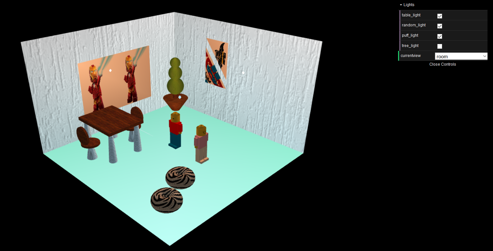

# LAIG-Project-FEUP

A project for the LAIG course (Graphical Applications Laboratory).  
LAIG is a 3rd year, 1st semester course (more info here:  
https://sigarra.up.pt/feup/en/ucurr_geral.ficha_uc_view?pv_ocorrencia_id=420004).  
  
The project consists of 3 sub-projects of increasing complexity and difficulty.

First project
---
Consists in a scene of a room with multiple elements such as lego figures, table, chairs, paintings, vase with plant, light sources and pouf chairs.
  

Second project
---
This scene displays an island with an animated spaceship. The scene uses NURBs, shaders and animations (linear and circular).  

Third project
---
The final project consists on the development of a graphical interface for a game.  
The logical component of the game had already been developed in another , 
by Susana Lima () and Gonçalo Santos ().

The game has multiple difficulty levels, PvP/PvC/CvC (P-Player; C-Computer) modes, animated game pieces, 2 different scenes (space and garden),
animated timers and markers, game menu and multiple toggable light sources.  

Contributors:
* Afonso Azevedo ([4-Z3r0](https://github.com/4-Z3r0))
* Susana Lima ([susanalima](https://github.com/susanalima))

This repository corresponds to a university project and as such is for educational purposes only.
